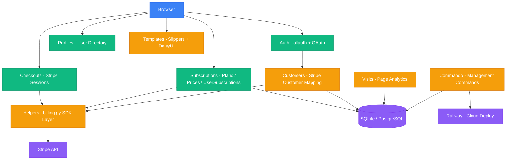

<div align="center">

# SaaS Django — Full-Stack Subscription Platform

**A production-ready SaaS billing platform built with Django 6, Stripe, and modern frontend tooling.**

[](https://www.python.org/)
[](https://www.djangoproject.com/)
[](https://stripe.com/)
[](https://tailwindcss.com/)
[](https://daisyui.com/)
[](https://www.docker.com/)
[](https://railway.app/)

[Features](#key-features) · [Architecture](#architecture) · [Tech Stack](#tech-stack) · [Getting Started](#getting-started) · [Routes](#api-routes)

</div>

---

## About

This project is a **full-stack SaaS subscription platform** that demonstrates end-to-end product engineering — from user registration and email verification, through Stripe-powered checkout and recurring billing, to role-based access control driven by subscription tiers.

It is designed as a **real-world foundation** for any subscription-based web product, not a tutorial toy app. The codebase follows Django best practices including signal-driven architecture, modular app design, custom management commands, and production-grade containerized deployment.

---

## Key Features

### Stripe Billing Integration
- **Checkout Sessions** — Redirects authenticated users to Stripe-hosted checkout with pre-filled customer data.
- **Product & Price Sync** — `Subscription` and `SubscriptionPrice` models automatically create corresponding Stripe Products and Prices on save via the Stripe SDK.
- **Checkout Finalization** — Post-payment callback resolves the Stripe session, maps the customer + plan back to Django, and provisions the user's subscription.

### Authentication & Customer Lifecycle
- Full auth flow via **django-allauth** — registration, login, email confirmation, password reset, and GitHub OAuth.
- **Automated customer provisioning** — `Customer` model is created on signup via allauth signals; Stripe Customer is created upon email verification.
- Clean separation between Django's `User`, `Customer` (Stripe mapping), and `UserSubscription` (plan assignment).

### Subscription & Permission Tier Engine
- Tiered permission framework (`basic`, `basic_ai`, `pro`, `advanced`) mapped to Django Groups and Permissions.
- `UserSubscription` model drives automatic group synchronization via `post_save` signals — changing a user's plan instantly updates their permissions.
- Preserves custom (non-subscription) groups during sync to avoid overwriting admin-assigned roles.

### Dynamic Pricing Page
- Public `/pricing/` route renders featured monthly and yearly plans with an interval toggle.
- Each plan displays a configurable subtitle, price, and feature list pulled from the database.
- Reusable pricing card component built with Django template snippets.

### User Profiles
- Profile directory (`/profiles/`) listing all active users.
- Individual profile detail pages at `/profiles/<username>/`.

### Access Control & Protected Routes
- `@login_required` — user-only pages.
- `@staff_member_required` — staff-only pages.
- Password-protected routes for sensitive content.

### Analytics — Page Visit Tracking
- `PageVisit` model logs every page hit with path and timestamp.
- Homepage dynamically calculates per-path visits, total site visits, and visit percentage.

### Reusable UI Component System
- Reusable template components via **Slippers** (Django component library) — form fields, pricing cards, navigation.
- **DaisyUI + Tailwind CSS** for a modern, themed UI with dark mode support.
- **django-allauth-ui** integration for pre-styled authentication pages.

### Custom Management Commands
| Command | Description |
|---------|-------------|
| `vendor_pull` | Downloads external vendor static files (Flowbite CSS/JS) |
| `sync_subs` | Synchronizes subscription permissions across all active user groups |

### Production-Ready Deployment
- **Multi-stage Dockerfile** with Gunicorn, WhiteNoise for static files, and a runtime initialization script.
- **Railway** deployment config (`railway.json`) for one-click cloud deployment.
- Environment-based configuration via `python-decouple` — no secrets in code.

---

## Architecture



---

## Tech Stack

| Layer | Technology |
|-------|-----------|
| **Language** | Python 3.12 |
| **Framework** | Django 6.0 |
| **Payments** | Stripe SDK (Products, Prices, Checkout Sessions, Subscriptions) |
| **Auth** | django-allauth (email + GitHub OAuth) |
| **UI Components** | Slippers, django-allauth-ui, django-widget-tweaks |
| **CSS / Styling** | Tailwind CSS 3.4, DaisyUI 5.x, Flowbite |
| **Database** | SQLite (dev) / PostgreSQL (prod) |
| **Static Files** | WhiteNoise |
| **Server** | Gunicorn |
| **Config** | python-decouple (`.env`) |
| **Containerization** | Docker (multi-stage build) |
| **Deployment** | Railway |

---

## Project Structure

```text
SaaS-django/
├── Saas_Django/               # Project configuration
│   ├── settings.py            #   Global settings, installed apps, middleware
│   ├── urls.py                #   Root URL routing
│   └── views.py               #   Core views (home, protected pages)
│
├── auth/                      # Custom authentication helpers
├── checkouts/                 # Stripe Checkout session flow
│   └── views.py               #   Checkout initiation, redirect, and finalization
├── commando/                  # Custom management commands
│   └── management/commands/   #   vendor_pull, sync_subs
├── customers/                 # Customer <-> Stripe mapping
│   └── models.py              #   Customer model, allauth signal handlers
├── helpers/
│   └── billing.py             # Stripe SDK abstraction layer
├── profiles/                  # User profile directory & detail views
├── subscriptions/             # Subscription engine
│   ├── models.py              #   Subscription, SubscriptionPrice, UserSubscription
│   ├── admin.py               #   Admin with inline price management
│   └── views.py               #   Pricing page view
├── visits/                    # Page visit analytics
│   └── models.py              #   PageVisit model
│
├── templates/                 # Global template directory
│   ├── base.html              #   Root layout
│   ├── components/            #   Reusable Slippers components (form, etc.)
│   ├── subscriptions/         #   Pricing page & card snippets
│   ├── allauth/               #   Customized allauth templates
│   └── nav/                   #   Navigation components
│
├── Dockerfile                 # Multi-stage production build
├── railway.json               # Railway deployment config
├── requirements.txt           # Python dependencies
├── package.json               # Frontend tooling (Tailwind, DaisyUI)
└── tailwind.config.js         # Tailwind CSS configuration
```

---

## Getting Started

### Prerequisites

- Python 3.12+
- Node.js (for Tailwind CSS build)
- A [Stripe](https://stripe.com/) account (test mode)

### 1. Clone & Set Up Environment

```bash
git clone https://github.com/ays19/SAAS.git
cd SAAS

# Create and activate virtual environment
python3 -m venv venv
source venv/bin/activate        # Linux / macOS
# venv\Scripts\activate.bat     # Windows CMD
# venv\Scripts\Activate.ps1     # Windows PowerShell

# Install dependencies
pip install -r requirements.txt
```

### 2. Configure Environment Variables

Create a `.env` file in the project root:

```env
DJANGO_SECRET_KEY=your-secret-key
DJANGO_DEBUG=True
BASE_URL=http://127.0.0.1:8000
STRIPE_SECRET_KEY=sk_test_...
```

### 3. Initialize the Application

```bash
python manage.py migrate
python manage.py vendor_pull
python manage.py sync_subs
python manage.py createsuperuser
```

### 4. Run the Development Server

```bash
python manage.py runserver
```

Open **http://127.0.0.1:8000/** in your browser.

---

## Docker

```bash
# Build
docker build -t saas-django .

# Run
docker run -p 8000:8000 \
  -e DJANGO_SECRET_KEY='your-secret-key' \
  -e STRIPE_SECRET_KEY='sk_test_...' \
  saas-django
```

---

## API Routes

| Route | Access | Description |
|-------|--------|-------------|
| `/` | Public | Homepage with visit analytics |
| `/pricing/` | Public | Subscription plans with monthly/yearly toggle |
| `/about/` | Public | About page |
| `/profiles/` | Public | Active user directory |
| `/profiles/<username>/` | Public | User profile detail |
| `/accounts/` | Public | Auth pages (login, signup, password reset) |
| `/checkout/<price_id>/` | Auth | Initiates Stripe Checkout for a plan |
| `/checkout/start/` | Auth | Redirects to Stripe-hosted checkout |
| `/checkout/success/` | Auth | Post-payment subscription provisioning |
| `/protected/` | Auth | Password-protected page |
| `/protected/user_only/` | Auth | Login-required page |
| `/protected/staff_only/` | Staff | Staff-only page |
| `/admin/` | Admin | Django admin panel |

---

## License

This project is licensed under the ISC License.

---

<div align="center">

**Built by [ays19](https://github.com/ays19)**

</div>
