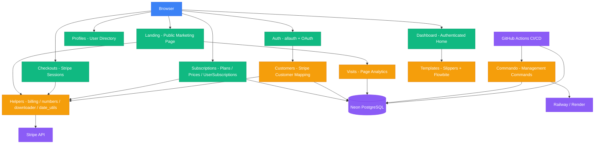

<div align="center">

# SaaS Django — Full-Stack Subscription Platform

**A production-ready SaaS billing platform built with Django 6, Stripe, and modern frontend tooling.**

[](https://www.python.org/)
[](https://www.djangoproject.com/)
[](https://stripe.com/)
[](https://tailwindcss.com/)
[](https://daisyui.com/)
[](https://flowbite.com/)
[](https://www.docker.com/)
[](https://railway.app/)

[Features](#key-features) · [Architecture](#architecture) · [Tech Stack](#tech-stack) · [Getting Started](#getting-started) · [Routes](#routes) · [CI/CD](#cicd)

</div>

---

## About

This project is a **full-stack SaaS subscription platform** that demonstrates end-to-end product engineering — from user registration and email verification, through Stripe-powered checkout and recurring billing, to role-based access control driven by subscription tiers.

It is designed as a **real-world foundation** for any subscription-based web product, not a tutorial toy app. The codebase follows Django best practices including signal-driven architecture, modular app design, custom management commands, and production-grade containerized deployment.

---

## Key Features

### Stripe Billing Integration
- **Checkout Sessions** — Redirects authenticated users to Stripe-hosted checkout with pre-filled customer data.
- **Product & Price Sync** — `Subscription` and `SubscriptionPrice` models automatically create corresponding Stripe Products and Prices on save via the Stripe SDK (API version `2024-06-20`).
- **Checkout Finalization** — Post-payment callback resolves the Stripe session, maps the customer + plan back to Django, and provisions the user's subscription.
- **Subscription Cancellation** — Users can cancel their subscription via `/accounts/billing/cancel/`, which sets `cancel_at_period_end` on Stripe so access continues until the billing cycle ends.

### Authentication & Customer Lifecycle
- Full auth flow via **django-allauth** — registration, login, email confirmation, password reset, and GitHub OAuth.
- **Automated customer provisioning** — `Customer` model is created on signup via allauth signals; Stripe Customer is created upon email verification.
- Clean separation between Django's `User`, `Customer` (Stripe mapping), and `UserSubscription` (plan assignment).

### Subscription & Permission Tier Engine
- Tiered permission framework (`basic`, `basic_ai`, `pro`, `advanced`) mapped to Django Groups and Permissions.
- `UserSubscription` model drives automatic group synchronization via `post_save` signals — changing a user's plan instantly updates their permissions.
- Preserves custom (non-subscription) groups during sync to avoid overwriting admin-assigned roles.
- Subscription statuses: `active`, `trialing`, `incomplete`, `past_due`, `cancelled`, `unpaid`, `paused`.

### Dynamic Pricing Page
- Public `/pricing/` route renders featured monthly and yearly plans with an interval toggle.
- Interval-specific view at `/pricing/<interval>/` for direct monthly or yearly links.
- Each plan displays a configurable subtitle, price, and feature list pulled from the database.
- Reusable pricing card component built with Django template snippets.

### User Profiles
- Profile directory (`/profiles/`) listing all active users (login required).
- Individual profile detail pages at `/profiles/<username>/` (login required).

### Landing Page
- Public marketing landing page with hero section, feature highlights, and social proof stats.
- Authenticated users are automatically redirected to the dashboard.
- Social proof section displays dynamically formatted page views using `helpers/numbers.py`.

### Dashboard
- Authenticated users land on a dedicated dashboard with a **sidebar navigation**, **top nav bar**, and **grid-based content area**.
- Dashboard layout is modular — `base.html`, `nav.html`, `sidebar.html`, and `main.html` partials for maintainability.
- Nav bar shows the logged-in user's initial, username, and email; links to Pricing, Billing settings, and Logout.
- User subscription detail and cancellation pages extend the dashboard layout.

### Auth-Aware Navigation
- Public navbar shows navigation links for anonymous users.
- Authenticated users see Dashboard and Logout links instead.
- All navigation uses Django `` tags — no hardcoded URLs.

### Analytics — Page Visit Tracking
- `PageVisit` model logs every page hit with path and timestamp.
- Landing page displays formatted visit counts (e.g. `8.2M`) via the `shorten_number()` helper.

### Reusable UI Component System
- Reusable template components via **Slippers** (Django component library) — form fields, pricing cards, navigation.
- **DaisyUI + Tailwind CSS + Flowbite** for a modern, themed UI with light theme support.
- **django-allauth-ui** integration for pre-styled authentication pages.
- Custom color palette (`primary` blue-based) with Inter font family.
- Tailwind build pipeline via `npm run dev` (watch) and `npm run build` (minified production CSS).

### Custom Management Commands
| Command | Description |
|---------|-------------|
| `vendor_pull` | Downloads external vendor static files (Flowbite CSS/JS, SaaS theme) from CDN |
| `sync_permissions` | Synchronizes subscription-based group permissions |
| `sync_user_subs` | Syncs user subscriptions from Stripe — supports `--day-start`, `--day-end`, `--days-ago`, `--days-left`, and `--clear-dangling` flags |

### CI/CD

Six GitHub Actions workflows automate testing and production maintenance:

| Workflow | Trigger | Description |
|----------|---------|-------------|
| `1-hello-world` | Scheduled (daily) | Basic smoke test |
| `2-test-django-basic` | Manual | Django test runner |
| `3-test-django-env-vars` | Manual | Tests with auto-generated secret key |
| `4-test-django-database-url` | Manual | Tests with Neon `DATABASE_URL` |
| `5-neon-db-branch-django-tests` | Push to `main` | Creates ephemeral Neon DB branch, runs tests, cleans up |
| `6-scheduled-production-worker` | Cron (twice daily + monthly) | Runs `sync_user_subs` to sync active subscriptions and clear dangling records |

### Production-Ready Deployment
- **Multi-stage Dockerfile** with Python 3.12, Gunicorn, WhiteNoise for static files, and a runtime initialization script.
- **Railway** deployment config (`railway.json`) for one-click cloud deployment.
- **Render** compatible (`ALLOWED_HOSTS` includes `.onrender.com`).
- **Neon** serverless PostgreSQL as the production database.
- Environment-based configuration via `python-decouple` — no secrets in code.

---

## Architecture



---

## Tech Stack

| Layer | Technology |
|-------|-----------|
| **Language** | Python 3.12 |
| **Framework** | Django 6.0 |
| **Payments** | Stripe SDK (API v2024-06-20 — Products, Prices, Checkout Sessions, Subscriptions) |
| **Auth** | django-allauth (email + GitHub OAuth) |
| **UI Components** | Slippers, django-allauth-ui, django-widget-tweaks |
| **CSS / Styling** | Tailwind CSS 3.4, DaisyUI 5.x, Flowbite 4.x |
| **Database** | SQLite (dev) / Neon PostgreSQL (prod via `DATABASE_URL` + `dj-database-url`) |
| **Static Files** | WhiteNoise (`CompressedStaticFilesStorage`) |
| **Server** | Gunicorn |
| **Config** | python-decouple (`.env`) |
| **Containerization** | Docker (multi-stage build) |
| **Deployment** | Railway, Render |
| **CI/CD** | GitHub Actions (6 workflows) |

---

## Project Structure

```text
SaaS-django/
├── Saas_Django/               # Project configuration
│   ├── settings.py            #   Global settings, installed apps, middleware
│   └── urls.py                #   Root URL routing (includes checkout & about views)
│
├── checkouts/                 # Stripe Checkout session flow
│   └── views.py               #   Price redirect, checkout redirect & finalization
├── commando/                  # Custom management commands
│   └── management/commands/   #   vendor_pull, hello_world
├── customers/                 # Customer ↔ Stripe mapping
│   └── models.py              #   Customer model with allauth signal handlers
├── dashboard/                 # Authenticated user dashboard
│   └── views.py               #   Login-required dashboard view
├── helpers/                   # Utility package (not a registered Django app)
│   ├── billing.py             #   Stripe SDK abstraction layer
│   ├── downloader.py          #   File download utility for vendor_pull
│   ├── date_utils.py          #   Timezone-aware timestamp conversion
│   └── numbers.py             #   Number formatting (e.g. 8.2M)
├── landing/                   # Public marketing landing page
│   └── views.py               #   Landing page with auth redirect to dashboard
├── profiles/                  # User profile directory & detail views
│   ├── views.py               #   Profile list & detail views (login required)
│   └── urls.py                #   /profiles/ and /profiles/<username>/
├── subscriptions/             # Subscription engine
│   ├── models.py              #   Subscription, SubscriptionPrice, UserSubscription
│   ├── utils.py               #   Subscription refresh, cleanup, permission sync
│   ├── admin.py               #   Admin with inline price management
│   ├── views.py               #   Pricing, billing detail, and cancellation views
│   └── management/commands/   #   sync_user_subs, sync_permissions
├── visits/                    # Page visit analytics
│   └── models.py              #   PageVisit model
│
├── templates/                 # Global template directory
│   ├── base.html              #   Root layout (public pages)
│   ├── home.html              #   Home / about page
│   ├── account/               #   Allauth account overrides (base, logout)
│   ├── allauth/               #   Allauth layout override
│   │   └── layouts/base.html
│   ├── base/                  #   Shared partials
│   │   ├── css.html           #   CSS includes
│   │   ├── js.html            #   JS includes
│   │   └── messages.html      #   Django messages display
│   ├── checkout/              #   Checkout pages
│   │   └── success.html       #   Post-checkout success
│   ├── components/            #   Reusable Slippers components
│   │   └── form.html          #   Form field component
│   ├── dashboard/             #   Dashboard layout partials
│   │   ├── base.html          #   Dashboard root layout
│   │   ├── main.html          #   Main content area
│   │   ├── nav.html           #   Top navigation bar
│   │   └── sidebar.html       #   Sidebar navigation
│   ├── landing/               #   Landing page sections
│   │   ├── main.html          #   Landing page layout
│   │   ├── hero.html          #   Hero section
│   │   ├── feature.html       #   Feature highlights
│   │   └── proof.html         #   Social proof section
│   ├── nav/                   #   Navigation components
│   │   └── navbar.html        #   Public navigation bar (auth-aware)
│   ├── profiles/              #   Profile pages
│   │   ├── list.html          #   User directory
│   │   └── detail.html        #   Individual profile
│   ├── protected/             #   Password-protected pages
│   │   ├── entry.html         #   Password entry form
│   │   ├── view.html          #   Protected content
│   │   └── user_only.html     #   Login-required page
│   ├── snippets/              #   Reusable snippets
│   │   └── welcome-user-msg.html
│   └── subscriptions/         #   Subscription pages
│       ├── pricing.html       #   Pricing page layout
│       ├── user_detail_view.html  # User subscription detail
│       ├── user_cancel_view.html  # Subscription cancellation
│       └── snippets/
│           └── pricing-card.html  # Reusable pricing card
│
├── src/
│   └── input.css              # Tailwind CSS entry point
├── staticfiles/               # Static assets (CSS, images, vendors)
│
├── .github/workflows/         # CI/CD pipelines (6 workflows)
├── Dockerfile                 # Multi-stage production build
├── build.sh                   # Runtime init (install, collectstatic, migrate)
├── railway.json               # Railway deployment config
├── requirements.txt           # Python dependencies
├── package.json               # Frontend tooling (Tailwind dev/build scripts)
└── tailwind.config.js         # Tailwind CSS configuration
```

---

## Getting Started

### Prerequisites

- Python 3.12+
- Node.js (for Tailwind CSS build)
- A [Stripe](https://stripe.com/) account (test mode)

### 1. Clone & Set Up Environment

```bash
git clone https://github.com/ays19/SAAS.git
cd SAAS

# Create and activate virtual environment
python3 -m venv venv
source venv/bin/activate        # Linux / macOS
# venv\Scripts\activate.bat     # Windows CMD
# venv\Scripts\Activate.ps1     # Windows PowerShell

# Install dependencies
pip install -r requirements.txt
```

### 2. Configure Environment Variables

Create a `.env` file in the project root (see `.env.example`):

```env
DJANGO_SECRET_KEY=your-secret-key
DJANGO_DEBUG=1
DATABASE_URL=                       # PostgreSQL connection string (optional — defaults to SQLite)
BASE_URL=http://127.0.0.1:8000
ALLOWED_HOSTS=.railway.app          # Comma-separated allowed hosts
STRIPE_SECRET_KEY=sk_test_...
STRIPE_TEST_OVERRIDE=False          # Set to True in CI to allow test keys without DJANGO_DEBUG

# Email (optional — defaults to console backend)
EMAIL_HOST=smtp.gmail.com
EMAIL_PORT=587
EMAIL_USE_TLS=True
EMAIL_HOST_USER=
EMAIL_HOST_PASSWORD=

# GitHub OAuth (optional)
GITHUB_CLIENT_ID=
GITHUB_CLIENT_SECRET=
```

### 3. Build Frontend Assets

```bash
npm install
npm run build            # one-time production build
# or
npm run dev              # watch mode during development
```

### 4. Initialize the Application

```bash
python manage.py migrate
python manage.py vendor_pull
python manage.py sync_permissions
python manage.py createsuperuser
```

### 5. Run the Development Server

```bash
python manage.py runserver
```

Open **http://127.0.0.1:8000/** in your browser.

---

## Docker

```bash
# Build
docker build -t saas-django .

# Run
docker run -p 8000:8000 \
  -e DJANGO_SECRET_KEY='your-secret-key' \
  -e STRIPE_SECRET_KEY='sk_test_...' \
  -e DATABASE_URL='postgres://...' \
  saas-django
```

The Dockerfile handles `vendor_pull` and `collectstatic` at build time. At runtime, migrations are applied automatically before Gunicorn starts.

---

## Routes

| Route | Access | Description |
|-------|--------|-------------|
| `/` | Public / Auth | Landing page (anonymous) or Dashboard redirect (authenticated) |
| `/about/` | Public | About page |
| `/pricing/` | Public | Subscription plans with monthly/yearly toggle |
| `/pricing/<interval>/` | Public | Interval-specific pricing view (monthly or yearly) |
| `/checkout/sub-price/<price_id>/` | Auth | Redirects to Stripe Checkout for a specific plan price |
| `/checkout/start/` | Auth | Creates Stripe Checkout Session and redirects to Stripe |
| `/checkout/success/` | Auth | Post-payment subscription provisioning callback |
| `/accounts/` | Public | Auth pages — login, signup, email verification, password reset (allauth) |
| `/accounts/billing/` | Auth | User subscription detail and management |
| `/accounts/billing/cancel/` | Auth | Subscription cancellation |
| `/profiles/` | Auth | Active user directory |
| `/profiles/<username>/` | Auth | User profile detail |
| `/protected/` | Auth | Password-protected page |
| `/protected/user_only/` | Auth | Login-required page |
| `/protected/staff_only/` | Staff | Staff-only page |
| `/admin/` | Admin | Django admin panel |

---

## License

This project is licensed under the ISC License.

---

<div align="center">

**Built by [ays19](https://github.com/ays19)**

</div>
